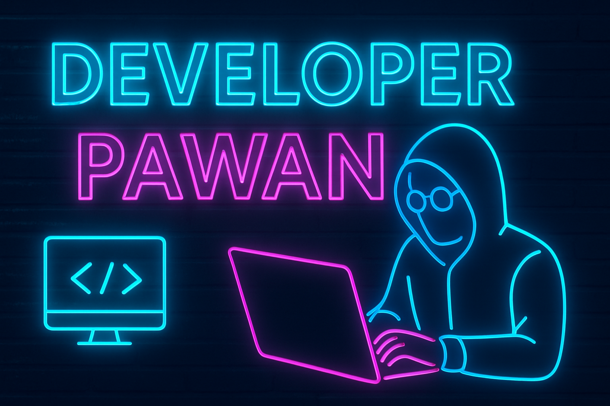

## Hi There 👋 Welcome To My Profile❤️

<!--
**pawansahaniofficial/pawansahaniofficial** is a ✨ _special_ ✨ repository because its `README.md` (this file) appears on your GitHub profile.

Here are some ideas to get you started:

- 🔭 I’m currently working on ...
- 🌱 I’m currently learning ...
- 👯 I’m looking to collaborate on ...
- 🤔 I’m looking for help with ...
- 💬 Ask me about ...
- 📫 How to reach me: ...
- 😄 Pronouns: ...
- ⚡ Fun fact: ...
-->

<!-- 3D Glowing Hacker Banner -->

  

<!-- Typing Tagline -->

  

---

  

<!-- Typing Intro -->

  

---

<h3 align="center">💻 Web Developer | 🎮 Game Developer | 🤖 AI Enthusiast | 🌍 From Nepal</h3>

### 🚀 About Me  
- 🌱 Currently learning **React.js, Java Script, Python, Node.js, and Cybersecurity**  
- 💼 Building my own projects & contributing to open-source  
- 🎯 Goal: Become a **Pro Developer & Ethical Hacker**  
- 🎮 Fun fact: I love playing **BGMI**  

---

## 🛠️ Languages & Tools  

  

---

## 📊 GitHub Stats  

  
  

  

---

## 📈 Activity Graph  

  

---

## 👀 Profile Visitors  

  

---

## 🏆 GitHub Trophies  

  

---

## 🌐 Connect With Me  

---

<!-- Social Media Badges -->

  
  
  <a href="https://www.tiktok.com/@sigma_pawan093?_r=1&_d=ek544jj0k75jki&sec_uid=MS4wLjABAAAAWRm3ftMifbP62c6YIXnZKrWceQ-xFWgioAOoPsdtLgisCYQBVJWb0HU1zXnBCF-I&share_author_id=7233582745564267522&sharer_language=en&source=h5_m&u_code=e81j9735367h7g&timestamp=1759648537&user_id=7233582745564267522&sec_user_id=MS4wLjABAAAAWRm3ftMifbP62c6YIXnZKrWceQ-xFWgioAOoPsdtLgisCYQBVJWb0HU1zXnBCF-I&item_author_type=1&utm_source=copy&utm_campaign=client_share&utm_medium=android&share_iid=7554952550090082049&share_link_id=c174d3cf-5cf6-4175-9c9a-c3038356afd3&share_app_id=1233&ugbiz_name=ACCOUNT&ug_btm=b8727%2Cb7360&social_share_type=5&enable_checksum=1" target="_blank">
    
  </a>

  
  

  
  
  

---

## ✨ Fun GIF  

  

---

## ✨ Developer Vibes  

  

---

⭐️ From [Pawan Sahani](https://github.com/pawansahani09)

